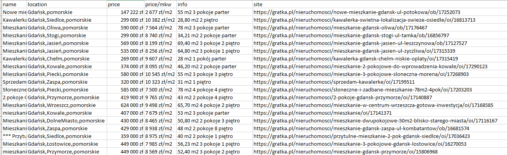

# Find annoucements real estate based on Gratka website.

To run script you have to:
* run RealEstate.py file.

Then script should create "results" folder in current path and save found annoucements in CSV file.

Content of CSV file should look alike:

You can easily modify path and name to create CSV file on your own changing "csv_name".